# SAML Lab Part 2 - Enable Okta for MFA

Okta and most other IdPs support Second Factor Authentication (2FA) or Multi-Factor Authentication (MFA). MFA is becoming more and more common in our customers because it is more secure than a Single Factor. In this part of the lab you will enable MFA for your SAML users. The configuration is all in Okta - Tableau does not really know that MFA is enabled. All Tableau needs to do is present any web pages that the MFA flow renders in web pages.

## Step 1 - Configure MFA

Sign back into Okta using the Okta Administrator account. From the **Security** menu select **Multifactor**

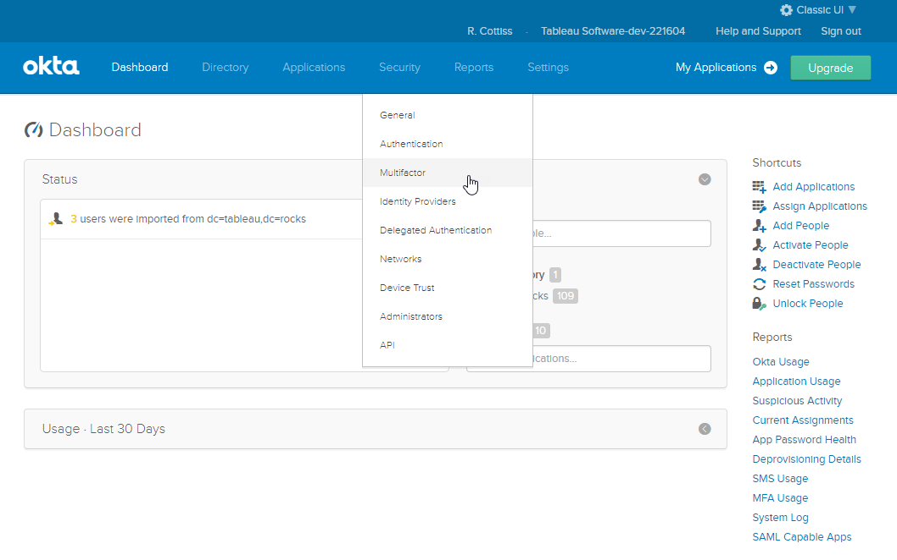

Okta supports several factor types and you can activate multiple types at the same time. SMS Authentication is one of the simpler to set up if you have a phone that can receive SMS messages. Enable SMS Authentication if you think you can receive SMS messages during the Lab session or you want to test this later

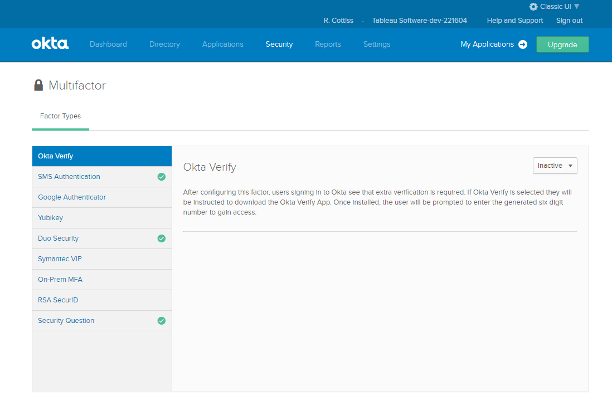

You can also create a security question. Enable this factor in addition to SMS. You will configure Okta to allow you to choose which factor to use on login.

Select Activate on the drop down after clicking on the factor you want to enable:

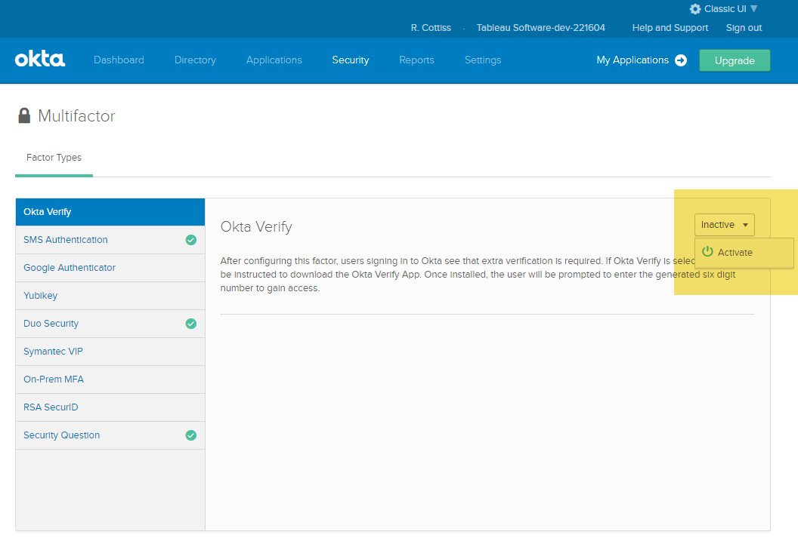

Okta is very flexible in how you enable MFA for groups or users. Some IdPs allow the user to self register for MFA. In this Lab we will force all users of Tableau Online to use one of the activated Multi Factor Types when authenticating.

In the Tableau Online Application scroll to the bottom where the Sign On Policy is located:

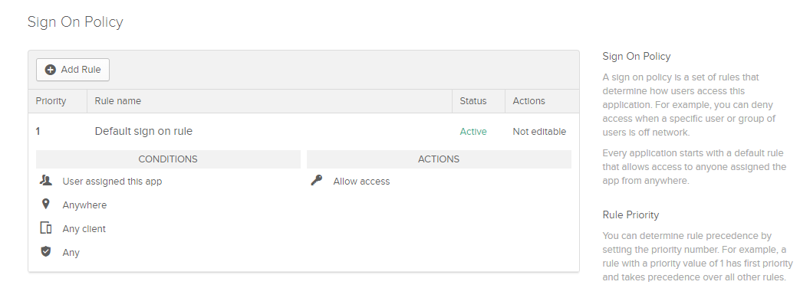

Click **Add Rule** and give it a name. Read the settings and understand the options. You can leave most options as defaults to enable MFA for all users assigned to the app.

>  You can limit the rule to a subset of user or groups and to certain network zones. You can also limit the rule to certain platforms.

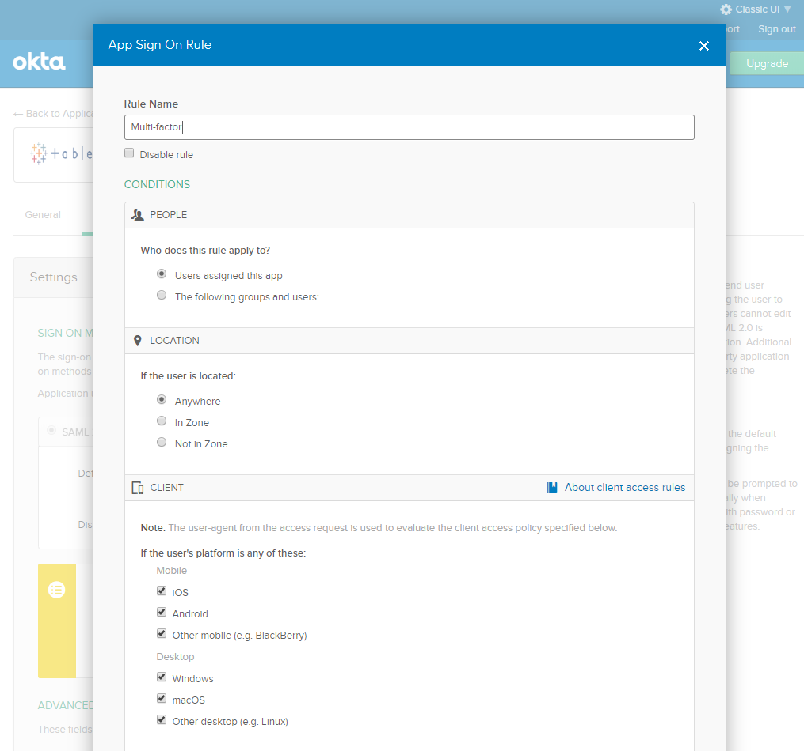

The rules pop up has more sections. Scroll down to see the Device Trust and Actions Sections:

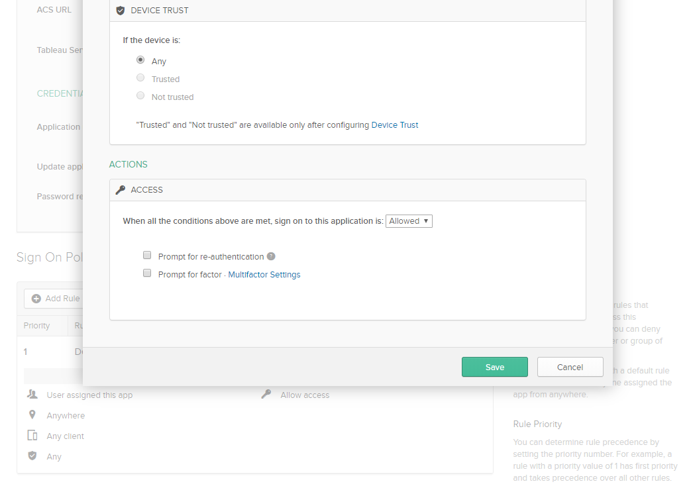

We did not configure device trust so Any is the only option.

For **Actions** select the *Prompt for Factor* checkbox. We already activated some Factor Types so all we need to do is to configure how often we want to prompt. Select *Every sign on* then 

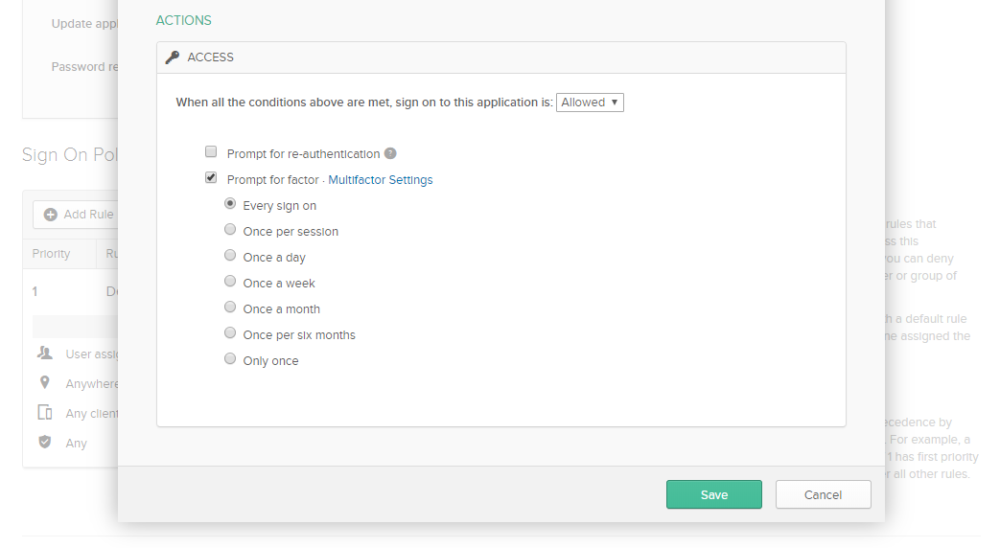

The Sign On Policy should look like this:

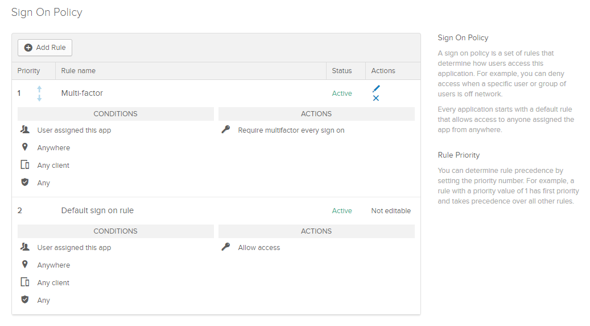

Sign out of Okta and Tableau Online and Sign onto Online again using the Online user we set up for SAML.

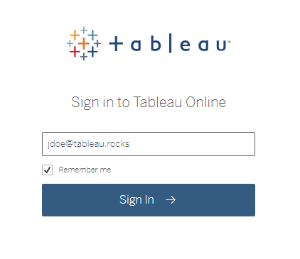

You will be redirected to Okta:

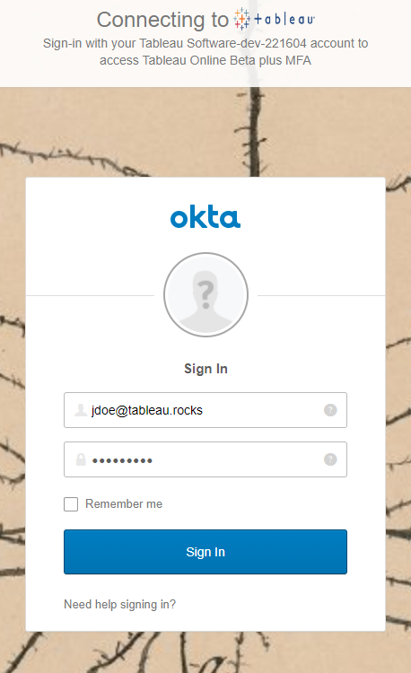

After entering the usual username and password you should get a second factor prompt. You can choose which factor to use by clicking on the down arrow next to the shield:

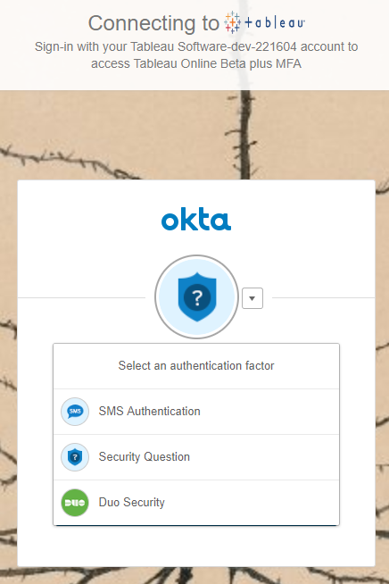

Pick *SMS authentication* if you can receive Text Messages, or *Security Question* if you do not have your phone  

>  If this is the first time for SMS you may be prompted to enter phone information:

Here is how SMS Authentication looks:

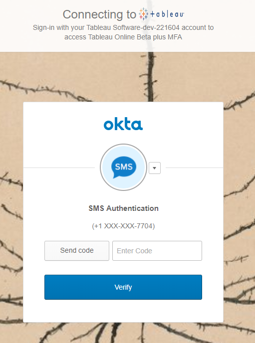

In the Apple Messages app:

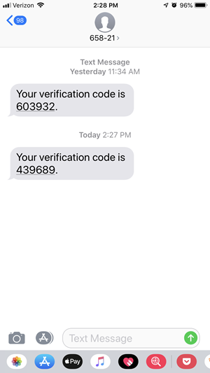

If you select Security Question you should be prompted to answer your question:

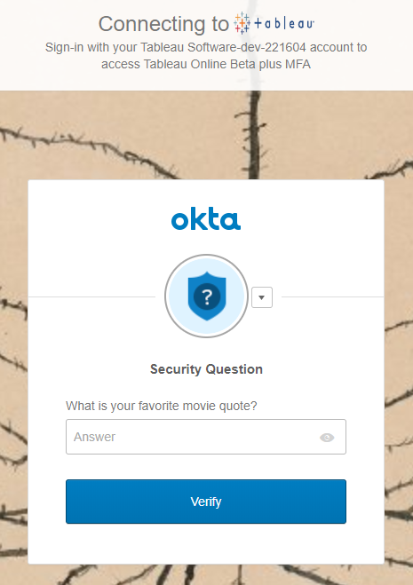

Enter your answer anc click **Verify**