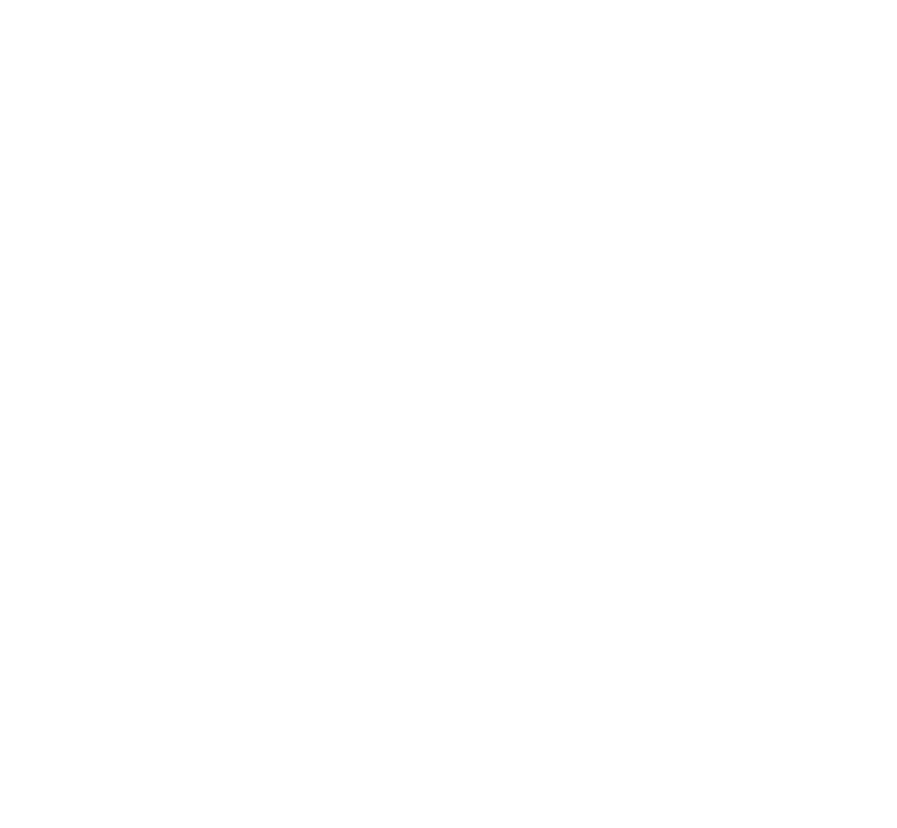
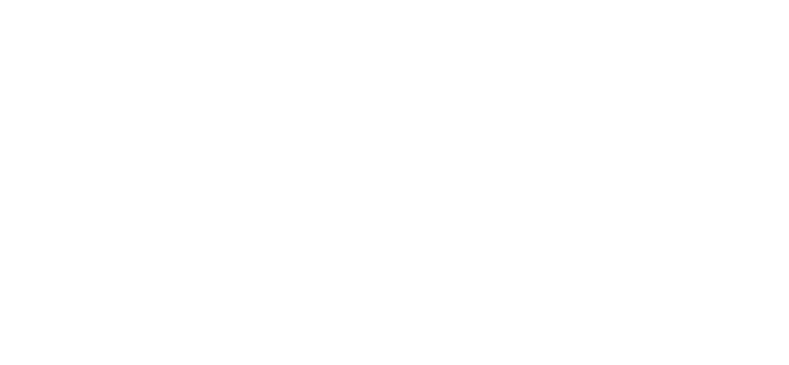

# SAML Lab - Setup Instructions

This lab assumes you have a Tableau Online Site and an Okta Development Account. If you have already configured your site for SAML you may want to save your existing configuration and create a new configuration for the lab as we will use Okta to configure SCIM and MFA.

## Step 1 - Sign into Online and Enable SAML  

In your Web Browser Log into you Online site as a Site Administrator and Select the **Authentication** section from the **Settings** menu.

Check *enable an additional authentication option* under **Authentication types**

## Step 2 - Sign into the Okta Development Console and create a new application

You may need to switch from the **Developer Console** to the **Classic UI**. You can do that from the top right corner

