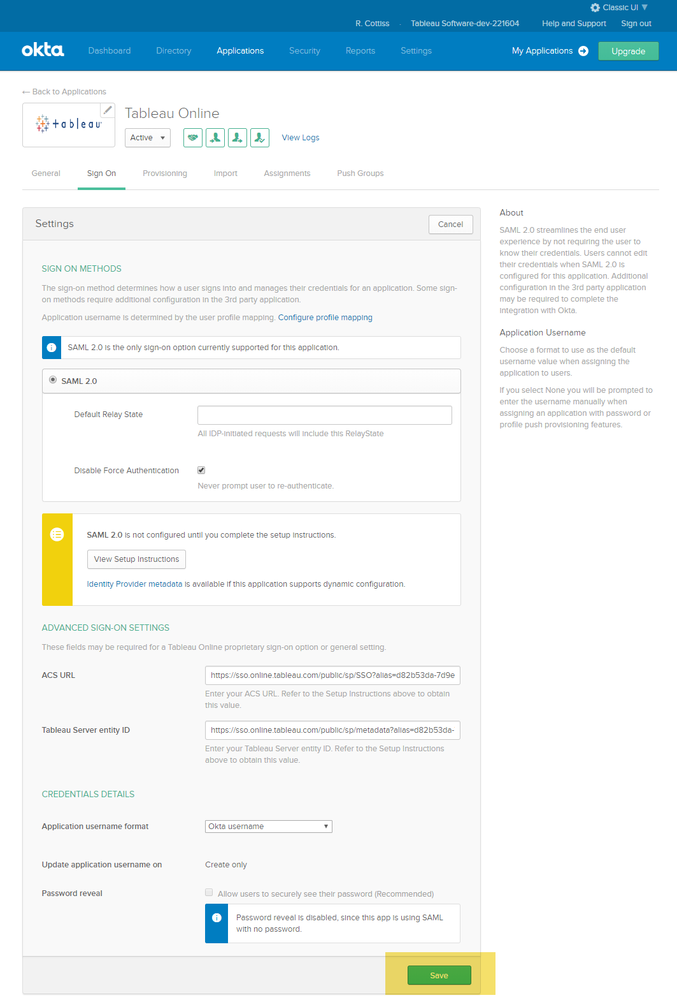
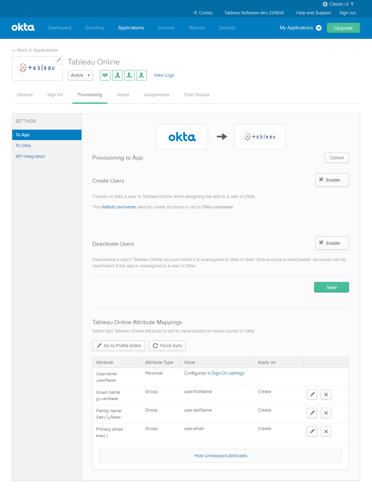
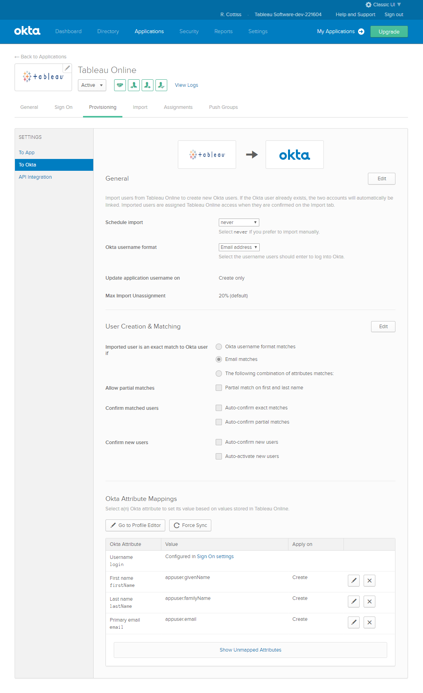
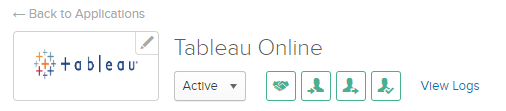
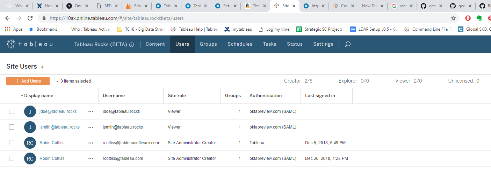

# SAML Lab Part 1 - Enable Tableau Online for SAML

This lab assumes you have a Tableau Online Site and an Okta Development Account. If you have already configured your site for SAML you may want to save your existing configuration and create a new configuration for the lab as we will use Okta to configure SCIM and MFA.

## Step 1 - Sign into Online and Enable SAML  

In your Web Browser Log into your Online site as a Site Administrator and Select the **Authentication** section from the **Settings** menu. Create a Bookmark for your site - you will use it several times during the lab.

Under Authentication types, Check 'Enable an additional authentication method'. Then, under SAML, click 'Edit Connection'.

## Step 2 - Sign into the Okta Development Console and create a new application

The console will be at [Okta - Dev Console](https://dev-xxxxxx-admin.oktapreview.com/admin/dashboard) where xxxxxx is your personal dev account (sent by Okta). Create a Bookmark for this link - you will use it several times during the lab.

You may need to switch from the **Developer Console** to the **Classic UI**. The Developer console looks like this after clicking **Add Application** You can do that from the top right corner

The Classic UI looks like this:

Search for Tableau and Select Tableau Online:

You can change the Application Label and change the application visibility. For the lab you can leave the defaults. Click **Done** to continue

The **Assignments** tab will display next. You can add users here but we are going to enable automatic provisioning with SCIM so we will add users later. If you do not want to enable SCIm you can add users and/or groups on this tab.

For now select the **Sign On** tab and then the **edit** button:

## Step 3 - Configure the Okta Sign On details and Import IdP Metadata to Tableau Online

You can now add the *ACS URL* and *Tableau Server entity ID* from your Online site.

>  Okta does not read the Metadata file but uses the second option in Step 1.  

You can click on the **View Setup Instructions** on the Okta page. This link is specific to your Site as it includes the link to the Idp Metadata. The setup instructions tell you to the following:

Copy the Entity ID and ACS from Tableau to Okta:

>  The Form fields may be in a different order between the app. This is why exchanging metadata via the metadata files is usually the safest option if it is available.
> Take care to copy the fields correctly. The Entity ID looks like a URL but has the word _metadata_ it it. The ACS URL is a real URL and has _SSO_ in it.

>  Technically the Entity ID is a just a string identifier

>  We do not need to download the Tableau certificate and load it into Okta. Why not?

Make sure you click 

Next download the Idp Metadata by clicking on the *Identity Provider metadata* link and saving the XML (right-click > Save as... in Chrome):

or right-click on the link and select *Save link as...*

Whichever way you choose, save the file to your local computer (I usually make the filename more explicit than the default)

Back in Tableau Online go to *Step 4* and Browse to the IdP metadata file you just downloaded:

## Step 4 - Configure Okta Provisioning

Tableau Online now supports automatic user provisioning from Okta using an open standard called [System for Cross-domain Identity management (SCIM)](http://www.simplecloud.info/)

Configuring SCIM requires some setup in Tableau Online and Okta.

In Tableau Online you enable SCIM at the bottom of the Authentication Setup page:

In Okta you select the Provisioning Tab in the Applications menu:

Click on **Configure API Integration** then check *Enable API integration* and copy the *Base URL* and *API Token* from the Online setup page.

>   The Secret API Token will not show again and if you forget it you will need to generate a new one to configure Okta.

You can click **Test API Credentials** to make sure you copied the Base URL and Secret correctly. Click  when done.

You will need to Enable at least **Create User**. Do this by selecting **To App** in the Provisioning Settings. Enable *Create Users* and *Deactivate Users* check boxes and click . This will enable Okta to make changes to Tableau Online.

Optionally you can configure SCIM so that the users are maintained in Online and then imported into Okta. Review the Settings in the **To Okta** page:

If you have correctly configured Okta to add and deactivate users in Online you should see the Icons enabled on the Application in Okta like this:

 The two push options on the right should NOT be grayed out.

## Step 5 - Add a User to Okta

Now that Okta and Tableau Online are configured you can add a new user to Okta and test the SCIM provisioning (and de-provisioning). Most Tableau customers will link Okta to an external Directory or Identity Store like Active Directory or LDAP so pushing from Okta to Online is a good option. Also, most customers will manage users via groups but in this lab you can create a single user directly in Okta then assign the user to our Tableau Online application.

In the **Directory** menu select **People** then **Add Person**

Enter the details of a new Okta user.

>  This user can be assigned to multiple applications in Okta and that is an extra step below.

Click 

## Step 6 - Assign the user to the Tableau Online application

You can assign users to applications in several ways. You can either do it from the Directory by clicking the user then **Assign Applications**

 and then selecting one or more applications:

Leave the username as the email and click **Save and Go Back**

Alternatively you can select **Applications** then the Tableau Online Application. Now you can assign the new user to Tableau Online. Click on **Assignments** in the Applications menu in Okta. Click on **Assign** then *Assign to People*

With SCIM enabled this is all you need to do. Okta will provision the new user in Tableau. You can confirm this by going back to Tableau Online and checking to see if the user got added:

[Note that the user was added as a Viewer - I am not sure if the default site role can be configured. Try testing with groups?]

## Step 7 - Test SAML Login

Sign out of your Site Admin account in Tableau Online and also sign out of the Okta Developer Console. If you do not sign out of Okta then when you sign in to Tableau using the new account Okta might show and error or send back the wrong assertion.

Now Sign into Tableau Online using the username of the user you assigned to the Tableau Online application in Okta. The browser should redirect you to Okta and present a login form.
