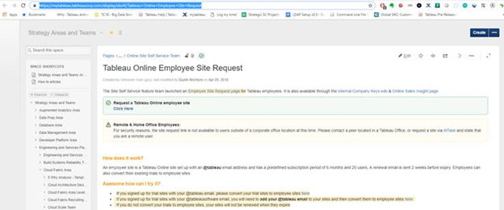
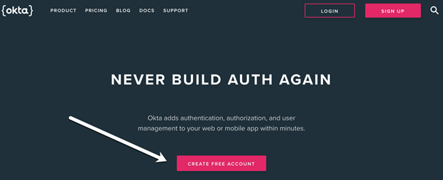
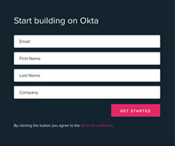
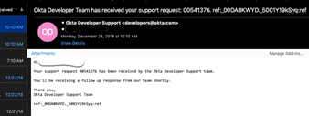
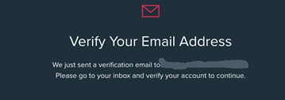

# SAML Lab Prerequisites

Here are the steps to prepare for the session exercise:

## Step 1 - Create an Employee Tableau Online Site

If you do not already have a personal Tableau Online Site, please create one now using the instructions [on the myTableau](https://mytableau.tableaucorp.com/display/devft/Tableau+Online+Employee+Site+Request) or [on Sales Insight](https://salesinsight.gosavo.com/CustomPage/View.aspx?id=34046580)

Note that home office/remote employees will need to create an ATTask (not ServiceNow ticket). It may take a couple of days to complete so please plan ahead.

## Step 2 - Sign up for Okta Developer Account

Please sign up for an [Okta Developers account](https://developer.okta.com/). Click on the **CREATE FREE ACCOUNT** button

This developer account is fully functional and free. You will be able to use it for learning and customer demos after gSKO.

Confirm your account via email:

## Step 3 - Complete Qualtrics Survey Form

After completing steps #1 and #2, please complete the [Qualtrics survey form](https://tableau.co1.qualtrics/jfe/form/SV_24dwS8oHACOvvGR) to let us know you have completed the Tableau Online and Okta Developer Account setup.

If you have issues with any steps you can email [Robin Cottiss](rcottiss@tableau.com) or create an [issue](https://github.com/geordielad/gsko2019/issues) on this Github repository.