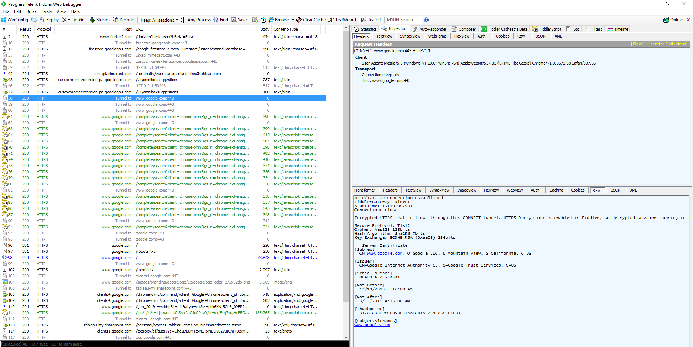
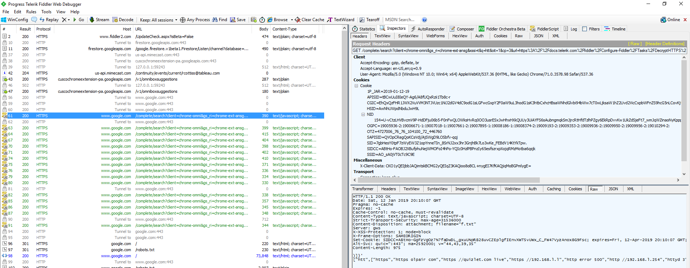
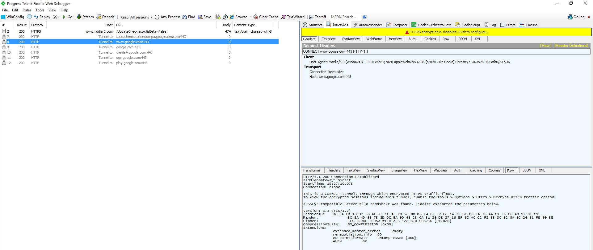

# Enable Fiddler to Decrypt HTTPS Traffic

Most IdPs and Tableau Servers will have HTTPS enabled. In order to view this traffic in Fiddler when troubleshooting a SAML Authentication flow you will need to decrypt the traffic to inspect the messages coming to and from your Web Browser ot Tableau Desktop.

Fiddler is Windows program so these instructions assume a Windows based Browser or Tableau Desktop for Windows.

The instructions are on the [Fidder Website](https://docs.telerik.com/fiddler/Configure-Fiddler/Tasks/DecryptHTTPS#enable-https-traffic-decryption). Note that the additional insrtuctions are needed only if you want to restrict decryption to specific hosts, or applications, or of you want to enable decryption for a specifc hostname. Restart Fiddler to ensure the messages are being decrypted. You may want to restart Tableau Desktop.

To confirm that decription is enabled in Fiddler try to connect to a website that is using HTTPS. For example [https://google.com](https://google.com). If you are capturing traffic in Fidder you will see something like below for the first *"tunnel to www.google.com:443"* Not that the Raw response data tells you that "*HTTPS Decryption is enabled in Fiddler*".

Also, if you inspect a non-tunnel message like line 61 below you will see that the request and response contain all the details of the messages.

If Decryption is not enabled then you will see a lot more "*tunnel to*" messages like this:

Note the lack of https messages on the left, the yellow warning and the response details. To fix this make sure HTTPS Decryption has been enabled and you remembered to restart Fiddler.